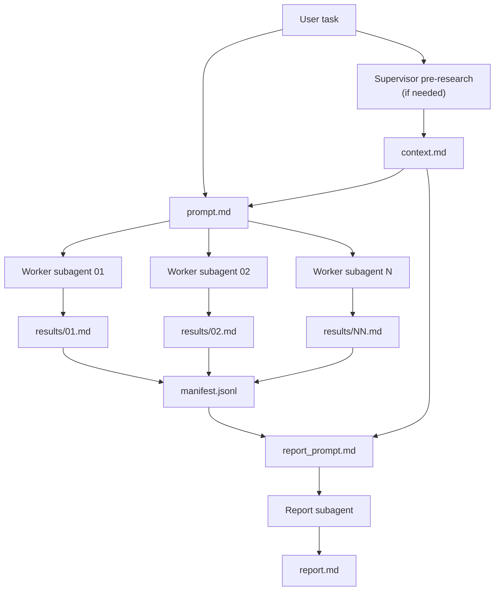

# Ask N Times

Ask N Times helps you see how much an AI answer changes when the same
underdetermined question is asked multiple times.

It is a Codex skill for stress-testing uncertain predictions and other
underdetermined AI answers with reproducible multi-agent sampling.

It runs one shared prompt through `N` independent subagents, saves every raw
result, and generates a separate synthesis report so you can inspect consensus,
disagreement, outliers, assumptions, and the full trail behind the final answer.

## What it does

Ask N Times is for questions where the useful signal is not just one answer,
but the spread between plausible answers.

```text
/askntimes N=3 Portugal vs Croatia in the 2026 FIFA World Cup. Estimate the most likely exact scores, probabilities, and reasons. You may research factual match context, but do not use human-vote forecasts such as Polymarket/Kalshi, betting odds, polls, or simulation results such as Opta Analyst.
--report highlight probability spread, exact-score clusters, assumptions, and dissent
```

One run might produce three raw forecasts that agree Portugal is more likely to
win but disagree on 1-0 vs 2-1, confidence, lineup assumptions, tactical matchups,
or how much recent form should matter. The final report surfaces those clusters
and dissenting views instead of flattening everything into one answer.

See the example files:

- [context.md](examples/portugal-vs-croatia-2026-world-cup_2026-06-30/context.md)
- [prompt.md](examples/portugal-vs-croatia-2026-world-cup_2026-06-30/prompt.md)
- [report.md](examples/portugal-vs-croatia-2026-world-cup_2026-06-30/report.md)

You can copy the same `context.md` and `prompt.md` into ChatGPT or the API,
run the prompt multiple times, and then synthesize those raw outputs into a
report like `report.md`. The exact wording and probabilities will vary, but the
outputs should be comparable enough to inspect whether the same clusters,
assumptions, and dissenting views recur.

## Why this approach

Ask N Times is built around a reproducible workflow, not a promise that any
single prediction outcome will be reproducible.

- Repeated sampling shows how much an answer drifts across plausible runs.
- Independent subagents reduce contamination from the supervisor's main-thread
  context, hidden reasoning, and report-only instructions.
- The run bundle creates an auditable trail from shared context and shared
  prompt to raw worker outputs and the final synthesis report.

The workflow is map/reduce-shaped: first collect shared context, then sample
independent worker answers, then ask one reporting subagent to reduce those raw
answers into a synthesis.



## Install

Clone the repo and copy the skill into your Codex skills directory:

```bash
git clone https://github.com/jichilfy/askntimes-skill.git
mkdir -p ~/.codex/skills
cp -R askntimes-skill/skills/askntimes ~/.codex/skills/askntimes
```

Restart Codex so it can pick up the new skill.

## Usage

Run the skill with an explicit slash command:

```text
/askntimes When will humans reach the Moon again?
```

Set the number of independent runs:

```text
/askntimes --n 5 compare these two product strategies
```

Add report-only instructions:

```text
/askntimes --n 3 --report highlight disagreements and outliers -- review this proposal
```

Choose an output directory:

```text
/askntimes --output-dir ./analysis estimate the most likely failure modes
```

By default, `N` is `3` and batch size is `5`.

## Output

Each run creates a bundle like:

```text
~/Documents/AskNTimes/runs/YYYYMMDD-HHMMSS-slug/
```

If that location is not writable in the current runtime, the skill falls back
to:

```text
.askntimes/runs/YYYYMMDD-HHMMSS-slug/
```

The run bundle contains:

```text
request.md
context.md
prompt.md
results/01.md
results/02.md
results/03.md
manifest.jsonl
references/reporting.md
report_prompt.md
report.md
```

The important files are:

- `prompt.md`: the exact shared prompt sent to every independent subagent
- `results/NN.md`: raw subagent outputs
- `manifest.jsonl`: index of result files and statuses
- `report_prompt.md`: prompt used for synthesis
- `report.md`: final synthesized report

## Isolation model

Ask N Times keeps sampling and reporting separate.

Report instructions, aggregation rubrics, and `--report` text are not included
in the prompt sent to the independent subagents. They are only used after the
raw results have been written.

For tasks that depend on current or unstable facts, the supervising agent may
do pre-research before launching subagents. Any such facts should be written to
`context.md` so every subagent sees the same source material.

## Runtime support

This skill is built for Codex native subagents. Other native-subagent runtimes
may work, but they are best-effort.

If a runtime cannot launch independent subagents, Ask N Times should stop
instead of pretending one conversation is independent sampling.

## Notes

Multiple model runs are not the same thing as independent human forecasts.
Treat the report as a way to inspect robustness and disagreement, not as a
statistically calibrated poll.

Large values of `N` can be slower and more expensive. The skill warns when
`N > 5` and asks for confirmation when `N > 20`.

## License

MIT
